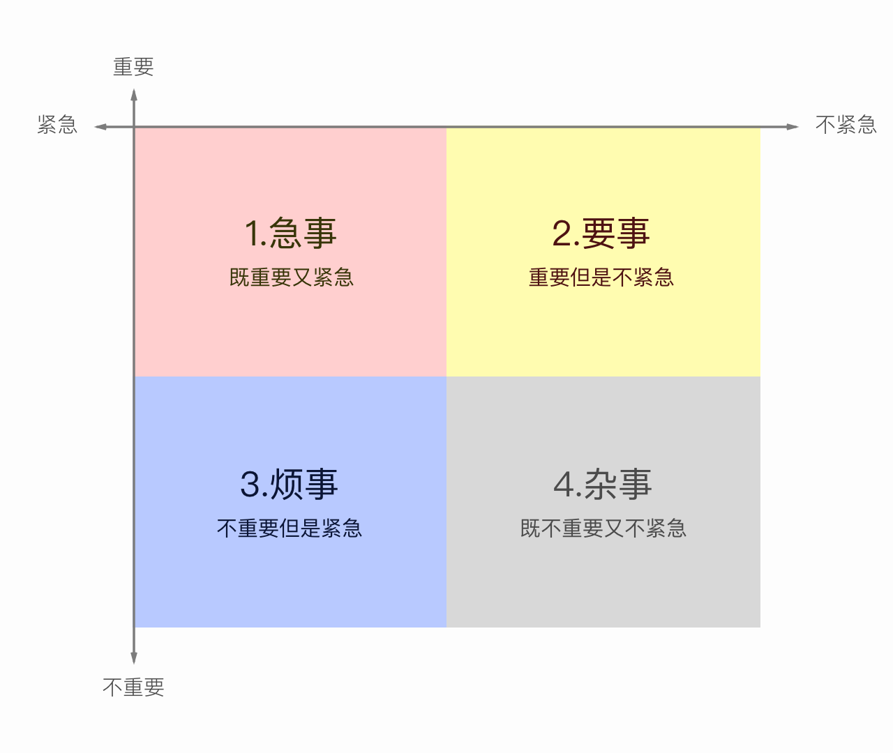

# Know-How

# 知识体系化

1. 长期主义的复利
2. 持续输出才能不断输入
3. 与同事沟通交流，打开新视角

# 工作方法论

1. 帕金森定律： 增加时间约束，思考真正有价值的东西。80%的价值在前20%的时间里就创造出来了。
2. 四象限梳理事情优先级
   

3. 全局视角思考问题🤔，沉淀方法论。通过整体框架图、流程图梳理方案、会议总结进行锻炼。
4. 最小成本起步。即先基于少量场景快速试错，验证链路正确性，再scaling到其他场景。
5. 梳理职业上限
6. 重思考 >>  轻思考埋头苦干 (不要用 战术上勤奋，掩盖战略上的懒惰)
7. 内核要稳    再复杂再困难的事情，按部就班做即可 

# 汇报/项目推进

1. 核心目的是确认价值，即方向是否正确、是否在解决真正的问题、leader信任支持

2. 整体顺序是  背景&目标 -> 方案及核心结论（行业做法、数据支撑、典型case、横向比较） -> 仍存在的问题（方案是否认可、协调资源） -> 后续规划（全局思考🤔）

